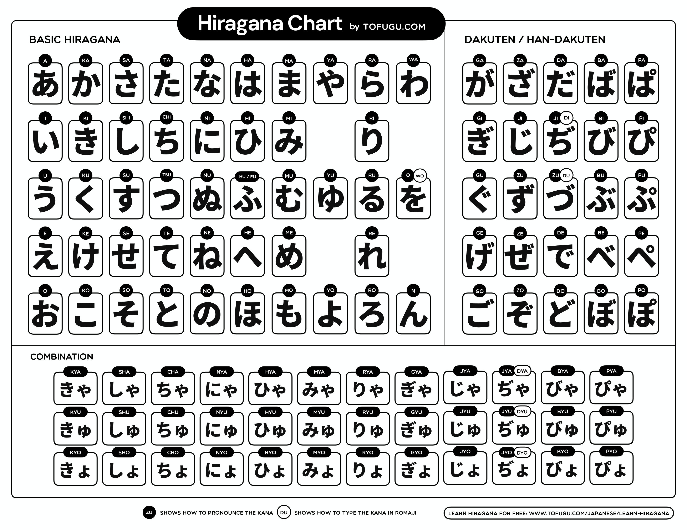
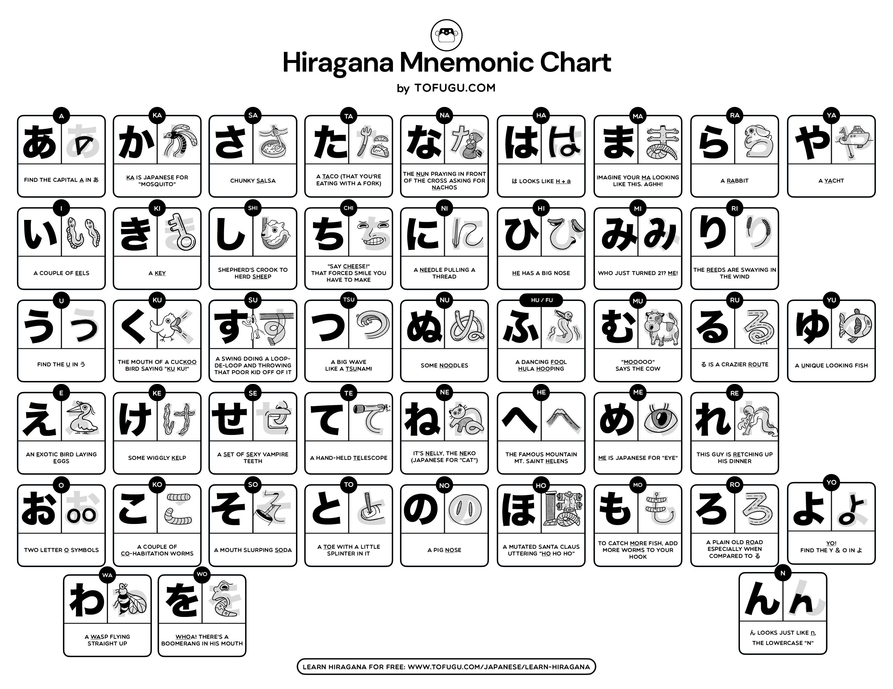

# ひらがな　-- Hiragana

- One of three にほんご writing systems.
- Enables you to read.
- Prerequisite for most beginner にほんご textbooks and resources.
- A good place to start.
- No writings: no need to learn how to handwrite it right of the bat.
  - Little payoff even if you learn to do it.
- Relatively simple.
- Image-based mnemonics are a perfect method for memorization (see "[Mnemonics and Worksheets](#mnemonics-and-worksheets) section below").

## What I'll learn by learning ひらがな

- Basics of にほんご pronunciation.

## Mnemonics and Worksheets

After studying each column of ひらがな, there are exercises to practice what you've learned.

> [!TIP]
>
> - No cheating! Try very very hard to remember it.
> - Struggle (with accomplishment) tells your brain that this is a thing worth remembering.

No need to print it out necessarily!

### Basics

1. Learn あいうえお pronunciations [here](https://youtu.be/O-3opZIjwr0).
2. Exercise [here][kana-exercise]
3. [Worksheet](https://docs.google.com/document/d/1muxTHS0NqIzKPUStedahoTRbvQRlUlQi0J3XMPi-DJE/edit?tab=t.0).
4. Learn かきくけこ pronunciations.
5. Exercise at least 5 times あいうえお + かきくけこ [here][kana-exercise].
6. [Worksheet](https://docs.google.com/document/d/164N1iT19YGaMpmImySONvLntsi8gehmQZU0GJLHC_q8/edit?tab=t.0).
7. Learn さしすせそ pronunciations.
8. Practice あいうえお + かきくけこ + さしすせそ [here][kana-exercise] at least 5 times.
9. [Worksheet](https://docs.google.com/document/d/1Zii4XH0bGOXAoYUTRy-bAZCo1SuKbiWZIoodJbWKMDA/edit?tab=t.0).
10. Learn たちつてと pronunciations.
11. Exercise at least 5 times あいうえお + かきくけこ + さしすせそ + たちつてと [here][kana-exercise].
12. [Worksheet](https://docs.google.com/document/d/12IIGe4lP212Twq3DSnhNzf6u8mVwYWoXLAEuG1DH1Js/edit?tab=t.0).
13. Learn なにぬねの + はひふへほ pronunciation.
14. Practice なにぬねの + はひふへほ [here][kana-exercise] at least 5 times.
15. [Worksheet](https://docs.google.com/document/d/1x4bretsJKt7R_zWh9a64aRK4qiY-JU6qYQe-68Qp-WM/edit?tab=t.0).
16. Learn まみむめも + やゆよ pronunciation.
17. Practice あいうえお + かきくけこ + さしすせそ + たちつてと + なにぬねの + はひふへほ + まみむめも + やゆよ [here][kana-exercise] at least 5 times.
18. [Worksheet](https://docs.google.com/document/d/1235hPLUNyaiyPf--_1jkrv9wpcVXLwnPw3ACx4KBIRQ/edit?tab=t.0).
19. [Learn how to pronounce らりるれろ here](https://youtu.be/V2wzUuGm7yw), after that you need to learn わをん.
20. Exercise all main Kana [here][kana-exercise].
21. [Worksheet](https://docs.google.com/document/d/1fKOrg5X5UkyZ6EhOMRa0qlr2jtVwrLQSHYk1iL9-ovQ/edit?tab=t.0).

### だくてん -- Dakuten

This double quotation like symbol: ゛

1. がぎぐげご. K -> G
2. ざじずぜぞ. S -> Z (exception: shi -> ji).
3. Questions:
   - Do you remember what the K-column converts to?
   - Do you remember what the S-column converts to?
   - What is the exception in the S-column?
4. だぢづでど. T -> D
   - Exception:
     - chi -> ji:
       - **Pronounced exactly like じ**.
       - When typing we must type 'di'.
     - tsu -> zu:
       - **Pronounced exactly like ず**.
       - When typing we must type 'du'.
5. Questions:
   - Do you remember what the K-column changes to?
   - Do you remember what the S-column changes to?
   - What about the T-column?
   - Do you remember the three exceptions we've run into so far?
6. ばびぶべぼ H -> B.
7. ぱぴぷぺぽ H -> P.
   - Han-dakuten: ゜.
   - Only applies to these Kanas.
8. Recall the mnemonics we used for the following (and remember what each converts to):
   - か -> ?
   - さ -> ?
   - た -> ?
   - は -> ?
   - は -> ?
9. [Practice only だくてん][kana-exercise], drill those for 5-10 minutes.
10. [Practice Main かな + だくてん　かな][kana-exercise].
11. [Worksheet](https://docs.google.com/document/d/1yAShOorugSANSMILnPfJjPnFOPCAKKN53usq5Jo-YuQ/edit?tab=t.0).

### き, し, ち, に, ひ, み, り, ぎ, じ, ぢ, び, ぴ + ゃ, ゅ, ょ

1. Drop the I-sound that comes from the い-row かな.

   - E.g.:
     - きゃ: KIYA -> KYA.
     - じょ: JIYO -> JYO.
   - **NOTE**:

     - しゃ: SHIYA -> SHA!
     - しゅ: SHIYU -> SHU!
     - しょ: SHIYO -> SHO!

     Same for ちゃ, ちゅ, ちょ,　じゃ, じゅ, じょ, ぢゃ, ぢゅ, ぢょ.

2. [Worksheet](https://docs.google.com/document/d/1Sy6zrBkkr9JVCwix-dTMSPVAl4cW5Z5jHTg-peiwbv8/edit?tab=t.0).

> [!TIP]
>
> To type:
>
> - Small や, ゆ, or よ you need to put an 'x' in front of it.
> - ぢゃ: dya (same rule for its siblings, e.g. cya for ちゃ or jyo for じょ).

[kana-exercise]: https://kana-quiz.tofugu.com/

https://www.tofugu.com/japanese/learn-hiragana/?utm_source=Tofugu&utm_medium=Article&utm_campaign=Learn%20Japanese

TK: Combination Hiragana Practice
