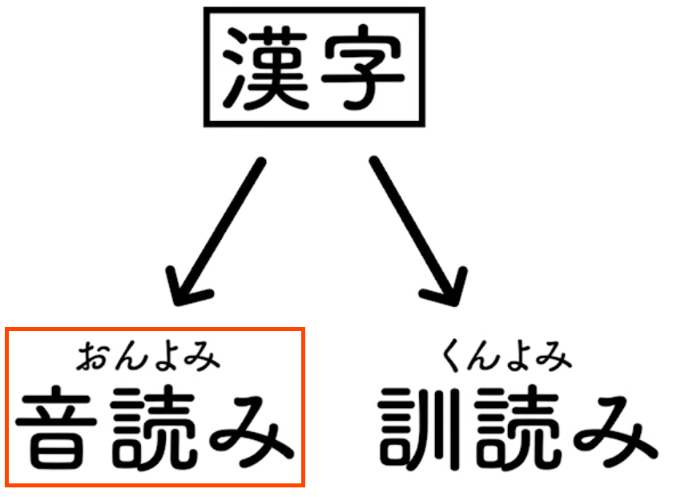
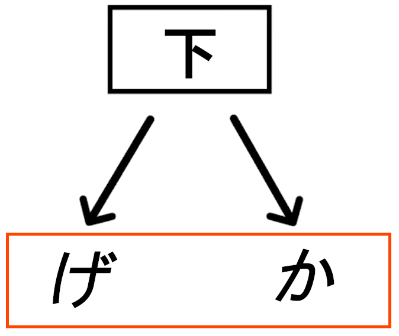

# 漢字 -- Kanji

Why are there two ways to read:

- 木? Is it もく or is it き?
- 山? Which one? さん or やま?

> [!NOTE]
>
> There are over 2,000 漢字 used in everyday life in 日本 (にほん). So try to learn it thoroughly.

## History

- 漢字 originated from China.
- Made their way through the Korean Peninsula, then hopped over to 日本.
- There are 漢字 characters that have many different readings.
  - As power in China changed (Han dynasty, Wu Dynasty, etc), so did the "official" language.
  - 下 is pronounced げ in one dynasty while it is pronounced か in another.
  - 日本 just adopt both Chinese readings for the same 漢字.

<h2> VS くんよみ</h2>

[Credit for the image goes to this Facebook video](https://fb.watch/wCQEpmz7Uw/)

- **Almost** all 漢字 will have:

  - A Chinese way of reading it (**derived** from Chinese):  -- おんよみ.
  - A Japanese way of reading it (indigenous Japanese): 訓読み -- くんよみ.

  | 漢字 | Meaning  |  | 訓読み |
  | ---- | -------- | -------------------------------------------------------- | ------ |
  | 水   | Water    | すい                                                     | みず   |
  | 火   | Fire     | か                                                       | ひ     |
  | 木   | Tree     | もく                                                     | き     |
  | 国   | Country  | こく                                                     | くに   |
  | 犬   | Dog      | けん                                                     | いぬ   |
  | 山   | Mountain | さん                                                     | やま   |
  | 女   | Woman    | じょ                                                     | おんな |
  | 男   | Man      | だん                                                     | おとこ |
  | 内   | Inside   | ない                                                     | うち   |
  | 目   | Eye      | もく                                                     | め     |

> [!NOTE]
>
> Most of the times we need to learn both.

### There are things that only have 

| 漢字 | Meaning  |  |
| ---- | -------- | -------------------------------------------------------- |
| 肉   | Meat     | にく                                                     |
| 材   | Lumber   | ざい                                                     |
| 感   | Feeling  | かん                                                     |
| 点   | Point    | てん                                                     |
| 医   | Doctor   | い                                                       |
| 茶   | Tea      | ちゃ                                                     |
| 胃   | Stomach  | い                                                       |
| 職   | Work     | しょく                                                   |
| 象   | Elephant | ぞう                                                     |
| 秒   | Second   | びょう                                                   |

### There are things that only have 訓読み

| 漢字 | Meaning        | 訓読み |
| ---- | -------------- | ------ |
| 畑   | Field          | はたけ |
| 姫   | Princess       | ひめ   |
| 匂い | Fragrant       | におい |
| 峠   | Mountain Pass  | とうげ |
| 枠   | Frame          | わく   |
| 籾   | Unhulled Rice  | もみ   |
| 鰯   | Sardine        | いわし |
| 栃   | Horse Chestnut | とち   |
| 込む | To Be Crowded  | こむ   |
| 咲く | To Bloom       | さく   |

### 漢字 with more than two  readings

- Words that use the げ reading:

  | 漢字 | Reading  | Meaning                     |
  | ---- | -------- | --------------------------- |
  | 下品 | げひん   | Crude, Vulgar               |
  | 下巻 | げかん   | Last volume (in a series)   |
  | 下旬 | げじゅん | End of the month            |
  | 下駄 | げた     | Geta, Japanese wooden clogs |
  | 下痢 | げり     | Diarrhea                    |

- Words that use the か reading:

  | 漢字   | Reading  | Meaning           |
  | ------ | -------- | ----------------- |
  | 地下   | ちか     | Underground       |
  | 以下   | いか     | Less than, Below  |
  | 地下鉄 | ちかてつ | Subway            |
  | 廊下   | ろうか   | Corridor, Hallway |
  | 却下   | きゃっか | Rejection         |

- Words from different Chinese language eras:

  - 呉音:
    - ごおん.
    - 4-6th century.
    - The Wu Dynasty pronunciation.
  - 漢音:
    - かんおん.
    - 7–9th century.
    - The Han Dynasty pronunciation.
  - 唐音:
    - とういん.
    - 1185–1573.
    - The "Chinese" pronunciation.
    - Closest to modern Chinese, i.e. Mandarin Chinese.

  | 漢字 | 呉     | 漢   | 唐     |
  | ---- | ------ | ---- | ------ |
  | 明   | みょう | めい | みん   |
  | 京   | きょう | けい | きん   |
  | 行   | ぎょう | こう | あん   |
  | 和   | わ     | か   | お     |
  | 頭   | ず     | とう | じゅう |
  | 珠   | しゅ   | しゅ | じゅ   |
  | 子   | し     | し   | す     |
  | 清   | しょう | せい | しん   |

- 上 with multiple 訓読み readings:

  <table>
    <caption>"To climb", "to raise", and "up" all have to do with upward things, so let's put them all inside 上!</caption>
    <thead>
      <tr>
        <th>漢字</th>
        <th>Vocabulary</th>
        <th>Reading</th>
        <th>Meaning</th>
      </tr>
    </thead>
    <tbody>
      <tr>
        <td rowspan="3"><b>上</b></td>
        <td>上</td>
        <td>うえ</td>
        <td>Up</td>
      </tr>
      <tr>
        <td>上げる</td>
        <td>あげる</td>
        <td>To Raise</td>
      </tr>
      <tr>
        <td>上る</td>
        <td>のぼる</td>
        <td>To Climb</td>
      </tr>
    </tbody>
  </table>

- 下 with multiple 訓読み readings:

  <table>
    <thead>
      <tr>
        <th>漢字</th>
        <th>Vocabulary</th>
        <th>Reading</th>
        <th>Meaning</th>
      </tr>
    </thead>
    <tbody>
      <tr>
        <td rowspan="3"><b>下</b></td>
        <td>下</td>
        <td>した</td>
        <td>Down</td>
      </tr>
      <tr>
        <td>下げる/下がる</td>
        <td>さげる/さがる</td>
        <td>To hang</td>
      </tr>
      <tr>
        <td>下さい</td>
        <td>ください</td>
        <td>Please</td>
      </tr>
    </tbody>
  </table>

- 生 with multiple 訓読み readings:

  <table>
    <thead>
      <tr>
        <th>漢字</th>
        <th>Vocabulary</th>
        <th>Reading</th>
        <th>Meaning</th>
      </tr>
    </thead>
    <tbody>
      <tr>
        <td rowspan="4"><b>生</b></td>
        <td>生</td>
        <td>なま</td>
        <td>Raw</td>
      </tr>
      <tr>
        <td>生む</td>
        <td>うむ</td>
        <td>To give birth</td>
      </tr>
      <tr>
        <td>生きる</td>
        <td>いきる</td>
        <td>To live</td>
      </tr>
      <tr>
        <td>生える</td>
        <td>はえる</td>
        <td>To grow</td>
      </tr>
    </tbody>
  </table>

## Two-kanji or More Compound Usually the Readings

| 日本語 | Reading    | Meaning |
| ------ | ---------- | ------- |
| 東京   | とうきょう | Tokyo   |
| 先生   | せんせい   | Teacher |
| 元気   | げんき     | Energy  |
| 最高   | さいこう   | Best    |
| 地下鉄 | ちかてつ   | Subway  |

- AKA 熟語 (じゅくご).
- No hanging-on ひらがな sticking out from the word.
  - When we have ひらがな sticking out it is called 送りがな.
    - Read it おくりがな.

## Single-kanji without any 送りがな uses the 訓読み Reading

- Make up the majority of beginner words you learn from textbooks.
- Nouns.

| 日本語 | Reading | Meaning |
| ------ | ------- | ------- |
| 人     | ひと    | Person  |
| 手     | て      | Hand    |
| 心     | こころ  | Heart   |
| 南     | みなみ  | South   |
| 冬     | ふゆ    | Winter  |

> [!CAUTION]
>
> There are plenty of single-kanji words that uses reading:
>
> | 日本語 | Reading | Meaning   |
> | ------ | ------- | --------- |
> | 本     | ほん    | Book      |
> | 天     | てん    | Heaven    |
> | 字     | じ      | Character |
> | 文     | ぶん    | Sentence  |
> | 一     | いち    | One       |

## 漢字 + ひらがな Attached to It (送りがな)

- All most always uses 訓読み readings.
- Mostly adjectives and verbs.

| 日本語 | Reading  | Meaning  |
| ------ | -------- | -------- |
| 大きい | おおきい | Big      |
| 食べる | たべる   | To eat   |
| 行く   | いく     | To go    |
| 玉ねぎ | たまねぎ | Onion    |
| 乗り場 | のりば   | Bus stop |

## How to Learn 漢字

- Just learn **one** reading per 漢字.
- Choose **the best** 漢字 reading to learn.
  - There will be a single reading that shows up in 80–90% of the vocabulary.
  - Forget about , forget about 訓読み.
  - Just think of "the best" reading as "the reading".

TK: https://www.tofugu.com/japanese/spaced-repetition/
https://www.tofugu.com/japanese/kanji-radicals-mnemonic-method/
https://www.wanikani.com/?utm_source=tofugu&utm_medium=article&utm_campaign=Onyomi%20Kunyomi%20Conclusion
