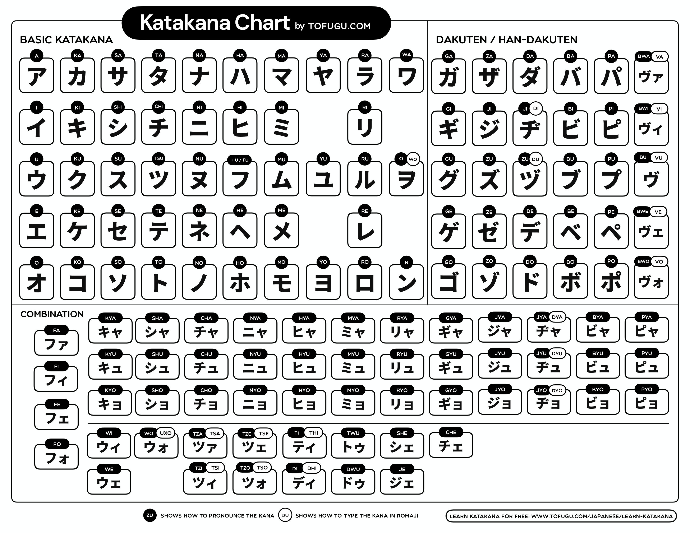
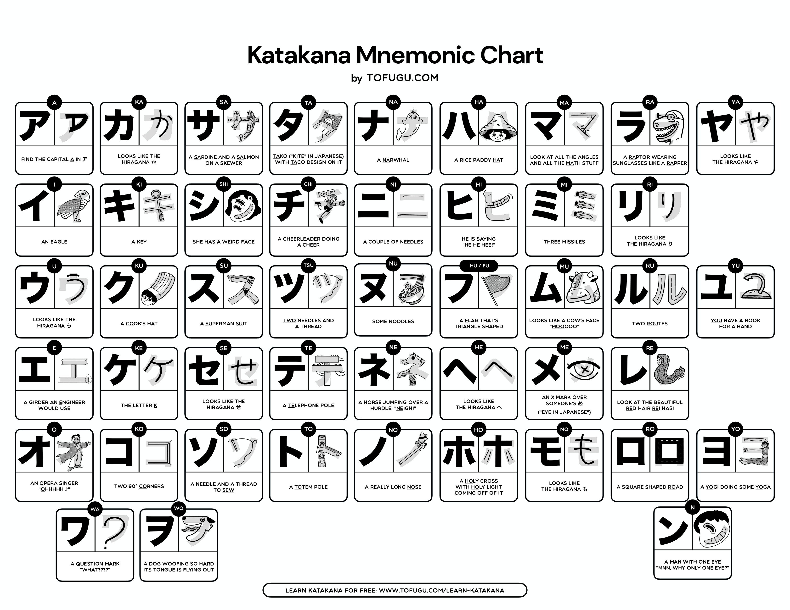

# Katakana

- Used for:
  - Transcribing foreign words.
  - Scientific words.
  - Animal names.
  - Many foods.
  - Onomatopoeia.
  - "Robot-speech" (as in, when you write out text for robots talking).
  - Various stylistic purposes.

## Target

- Deadline: 27.12.2024.
- Reading katakana may not come as quickly as it did with ひらがな. ひらがな and 漢字 are just more useful right now, so spend your limited time and energy there.
- Once you can read each katakana character - no matter how slowly - move on.

## Katakana chart

## Katakana mnemonic chart

## How to Go About It

1. Learn アイウエオ + カキクケコ mnemonics [here][katakana-mnemonic] (same pronunciation as their ひらがな counterparts).
2. [Exercise ア, and カ][kana-exercise] (repeat this exercise until you're able to answer them all in 20 seconds or at least 5 times).
3. [Worksheet](https://docs.google.com/document/d/1vq600qg-FVbMofnbCNOLFtn5tNiouXx2kTMegnzPqSU/edit?tab=t.0).
4. Learn サシスセソ + タチツテト mnemonics [here][katakana-mnemonic].
5. [Exercise アイウエオ + カキクケコ + サシスセソ + タチツテト][kana-exercise] (repeat the exercise at least 5 times).
6. [Worksheet](https://docs.google.com/document/d/1pxuEjzsey_zkqBxSzgcT1qytGRcjJdx7EEIbMR5uN7w/edit?tab=t.0).
7. Learn ナニヌネノ + ハヒフヘホ mnemonics [here][katakana-mnemonic].
8. [Exercise アイウエオ + カキクケコ + サシスセソ + タチツテト + ナニヌネノ + ハヒフヘホ][kana-exercise].
9. [Worksheet](https://docs.google.com/document/d/1-LJKrZ6b_vy9TA24QF1FS3P6taZMR2TdwbS6V7ixEwQ/edit?tab=t.0).
10. Learn マミムメモ + ヤユヨ mnemonics [here][katakana-mnemonic].
11. [Exercise アイウエオ + カキクケコ + サシスセソ + タチツテト + ナニヌネノ + ハヒフヘホ + マミムメモ + ヤユヨ][kana-exercise] for 5 times.
12. [Worksheet](https://docs.google.com/document/d/1a9dtvUlN-Jyt5UAiD8tAaZWqOhmnQY8mOfBvMjqLhqQ/edit?usp=sharing).
13. Lear ラリルレロ + ワヲン mnemonic [here][katakana-mnemonic].
14. [Exercise アウイエオ + カキクケコ + サシスセソ + タチツテト + ナニヌネノ + ハヒフヘホ + マミムメモ + ヤユヨ + ラリルレロ + ワヲン][kana-exercise].
15. [Worksheet](https://docs.google.com/document/d/1UGzyVHcREJAvFWmwEWfupn0GPY-tOmXXTo0fj69fEy4/edit?tab=t.0).

### カタカナ + 濁点

If you know ひらがな's 濁点, you know カタカナ's 濁点.

| K => G | S => Z | T => D              | H => B | H => P |
| ------ | ------ | ------------------- | ------ | ------ |
| ガ     | ザ     | ダ                  | バ     | パ     |
| ギ     | ジ JI  | ヂ JI (Type DI) | ブ     | プ     |
| グ     | ズ     | ヅ ZU (Type DU) | ビ     | ピ     |
| ゲ     | ゼ     | デ                  | ベ     | ペ     |
| ゴ     | ゾ     | ド                  | ボ     | ポ     |

**Exception**

- ヴ which we pronounce "vu".

### Combining Small and Big カタカナ to Make New Sounds

- **Same as ひらがな**:
  - キャ、キュ、キョ。
  - ギャ、ギュ、ギョ。
  - シャ、シュ、ショ。
  - ジャ、ジュ、ジョ。
  - チャ、チュ、チョ。
  - ヂャ、ヂュ、ヂョ。
  - ニャ、ニュ、ニョ。
  - ヒャ、ヒュ、ヒョ。
  - ビャ、ビュ、ビョ。
  - ピャ、ピュ、ピョ。
  - ミャ、ミュ、ミョ。
  - リャ、リュ、リョ。
- **Long vowels**:
  - ひらがな adds more vowels to things to make it longer.
  - カタカナ has a special vowel extender character, a dash: ー.
  - E.g.:
    - チーズ = cheese.
    - ベーコン = bacon.
    - ベーコンチーズバーガー = bacon cheese burger.
- **There are many sounds commonly used in non-Japanese languages that カタカナ needs to try to account for**:
  - V:
    - ヴァ。
      - VA.
      - E.g. ヴァンパイア for vampire :kidding:.
    - ヴィ。
      - VI.
      - E.g. ヴィーガン for vegan or ヴィジュアル for visual.
    - ヴェ。
      - VE.
      - E.g. ヴェネツィア for Venice (a city in Italy).
    - ヴォ。
      - VO.
      - E.g. ヴォルデモート for Voldemort (a character in harry potter).
  - W:
    - ウィ。
      - WI.
      - E.g. ウィンドウズ for Windows.
    - ウェ。
      - WE.
      - E.g. ウェブサイト for website.
    - ウォ。
      - WO
      - Type: uxo.
      - E.g. ウォッカ for Vodka.
  - F:
    - ファ。
      - FA.
      - E.g. ファイル for file.
    - フィ。
      - FI.
      - E.g. フィレンツェ for Florence (a city in Italy).
    - フェ。
      - FE.
      - E.g. フェラーリ for Ferrari.
    - フォ。
      - FO.
      - E.g. フォー レシピ for Pho recipe.
  - Z/S:
    - ツァ。
      - TZA/TSA.
      - Type: TSA.
      - E.g. ツァーリ for Tsar or モッツァレラ for Mozzarella.
    - ツィ。
      - ZI/SI.
      - Type: TSI.
      - E.g. ツィンク for Zink (a chemical element).
    - ツェ。
      - ZE/SE.
      - Type: TSE.
      - E.g. ツェムリンスキー for Zemlinsky (an Austrian composer, conductor, and teacher).
    - ツォ。
      - TZO/TSO.
      - Type: TSO.
      - E.g. ツォルキン for Tzolkin (the 260-day Mesoamerican calendar used by the Maya civilization).
  - Other sounds:
    - シェ。
      - SHE.
      - E.g. シェパーズパイ for Shepherd's pie (it is not a cake though :joy:).
    - ジェ。
      - JE.
      - E.g. ジェノベーゼパスタ for Genovese pasta.
    - チェ。
      - CHE.
      - E.g. チェンソーマン for Chainsaw Man.
    - トゥ。
      - TWU.
      - Examples:
        - トゥイーティー for Tweety (a yellow canary in an animated cartoon).
        - トゥモローランド for Tomorrowland :confused:.
        - トゥミ for Tumi.
        - トゥクトゥク for tuktuk, AKA Auto rickshaw.
        - トゥワイス for Twice.
    - ティ。
      - TI.
      - Type: THI.
      - E.g. ティファニー for Tiffany
    - ドゥ。
      - DWU.
      - E.g. ドゥクラッセ for Declasse or ドゥブロヴニク for Dubrovnik (a city in Croatia).
    - ラッ
      - LU/RA.
      - ラッキー for lucky.
      - ラッコ for sea otter.
    - ディ。
      - DI.
      - E.g. ディズニーランド for Disneyland.
      - Type: DHI.

TK: Additional Practice

https://www.tofugu.com/japanese/learn-katakana/?utm_source=Tofugu&utm_medium=Article&utm_campaign=Learn%20Japanese

[kana-exercise]: https://kana-quiz.tofugu.com/
[katakana-mnemonic]: https://www.tofugu.com/japanese/learn-katakana/?utm_source=Tofugu&utm_medium=Article&utm_campaign=Learn%20Japanese
