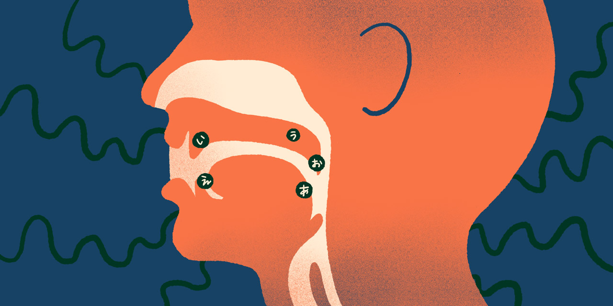
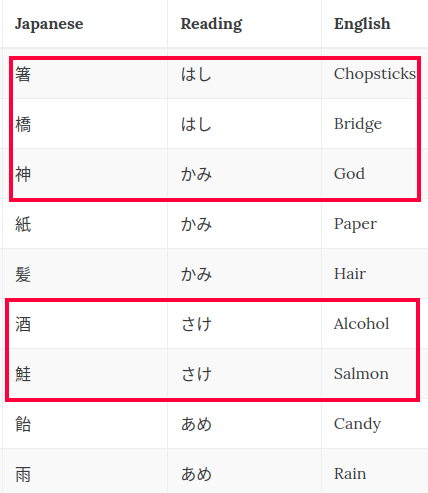

# Japanese Pronunciation -- Sounds, Words, and Sentences

- Spend an hour going through this doc.
- The mouth shapes, the sounds, the tongue positions.
- Optional prerequisite: ひらがな and some カタカナ.
- Written Japanese, is made up of three parts:
  - ひらがな (hiragana).
  - カタカナ (Katakana).
  - Kanji.
- Hiragana and katakana are phonetic syllabaries:
  1. The symbols represent sounds.
  2. Each symbol represents a syllable.
- ひらがな and katakana look different, they both:
  - Represent the same sounds.
  - Have different uses.
- Each hiragana symbol represents a syllable sound.
  - Just because you know how to pronounce a word in English doesn't mean you know how to spell it.
    - English is a much more phonetically rich language.
  - Japanese, has mostly kept up with how words are pronounced and written.
    - Similar to Persian.
- Instead of splitting up their individual sounds, Japanese keeps these sounds in larger chunks:
  - か -> ka.

## Japanese Vowels

- The tongue's height: the tongue can be in the high, mid, or low position.
- The tongue's dimensions: the tongue can be front, center, or back.

あ = low, center

い = high, front

う = high, back

え = mid, front

お = mid, back

- They pretty much never change.
  - They're always pronounced the same way, no matter what word they're in, and what they come before or after doesn't change them.

## Consonants

- Where the sound is blocked.
- How the sound is blocked.
- If your vocal cords vibrated.
- If it went through your mouth or your nose.

> [!CAUTION]
>
> Pronunciation matters + Kanji i a must + context will help you to convey your meaning.
>
> 

Actually I quite near the end of [this](https://www.tofugu.com/japanese/japanese-pronunciation/?utm_source=Tofugu&utm_medium=Article&utm_campaign=Learn%20Japanese) since it was getting on my nerve: but I might go back to it to practice some real japanese sentences there.
